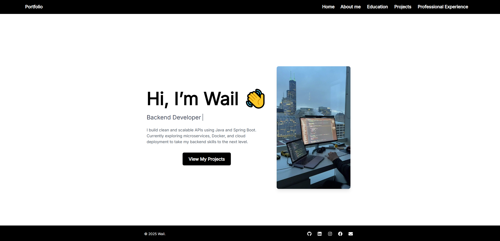

# 🧑‍💻 Wail's Developer Portfolio

Welcome to my personal portfolio built using **React** and **Tailwind CSS**!  
This site showcases my background, projects, and skills as a backend developer focused on Java and Spring Boot.

🔗 **Live site**: [https://waildevil.vercel.app/](https://waildevil.vercel.app/)

---

## 📸 Preview



---

## 🚀 Features

- 🔁 Responsive multi-page layout
- 🎨 Built with Tailwind CSS
- 💻 React Router for page navigation
- 🧠 Typewriter animation with `react-simple-typewriter`
- ✨ Smooth transitions with Framer Motion
- 📄 Downloadable CV
- 📦 Deployed on [Vercel](https://vercel.com)

---

## 🛠️ Technologies Used

- React
- Tailwind CSS
- Framer Motion
- React Simple Typewriter
- React Router DOM
- Vite
- Git + GitHub
- Vercel (deployment)

---

## 📁 Project Structure

```text
portfolio-cv/
├── public/
│   ├── index.html
│   ├── Mohamed-Wail-Homan_CV.pdf
│   └── images/
│       ├── programming.jpg
│       ├── jobboard.jpg
│       └── ...
├── src/
│   ├── components/
│   │   ├── Navbar.jsx
│   │   └── Footer.jsx
│   ├── pages/
│   │   ├── Home.jsx
│   │   ├── About.jsx
│   │   ├── Projects.jsx
│   │   ├── Education.jsx
│   │   ├── Experience.jsx
│   │   └── Skills.jsx
│   ├── App.js
│   ├── index.css
│   └── index.js
├── tailwind.config.js
├── postcss.config.js
├── package.json
├── .gitignore
└── README.md
```

---

## 🧪 Getting Started (Local Development)

To run this project locally:

### 1. Clone the repository

```bash
git clone https://github.com/waildevil/portfolio-cv.git
cd portfolio-cv
```

### 2. Install dependencies

Make sure you have **Node.js** installed (preferably Node 18+):

```bash
npm install
```

### 3. Start the development server

```bash
npm run dev
```

Now open your browser and go to: [http://localhost:5173](http://localhost:5173)

---

## 🌐 Deployment

This project is deployed on [Vercel](https://vercel.com), and it's automatically rebuilt on every GitHub push.

No need to include `node_modules` in GitHub — Vercel handles the build with `package.json`.

---

## 📫 Contact

Want to get in touch?

- 📧 Email: [wail.homanwork@hotmail.com](mailto:wail.homanwork@hotmail.com)
- 🔗 LinkedIn: [linkedin.com/in/wailhoman](https://www.linkedin.com/in/wailhoman)
- 🐙 GitHub: [github.com/waildevil](https://github.com/waildevil)

---

## 📄 License

This project is intended for personal and educational use.  
© 2024 Mohamed Wail Homan — All rights reserved.
